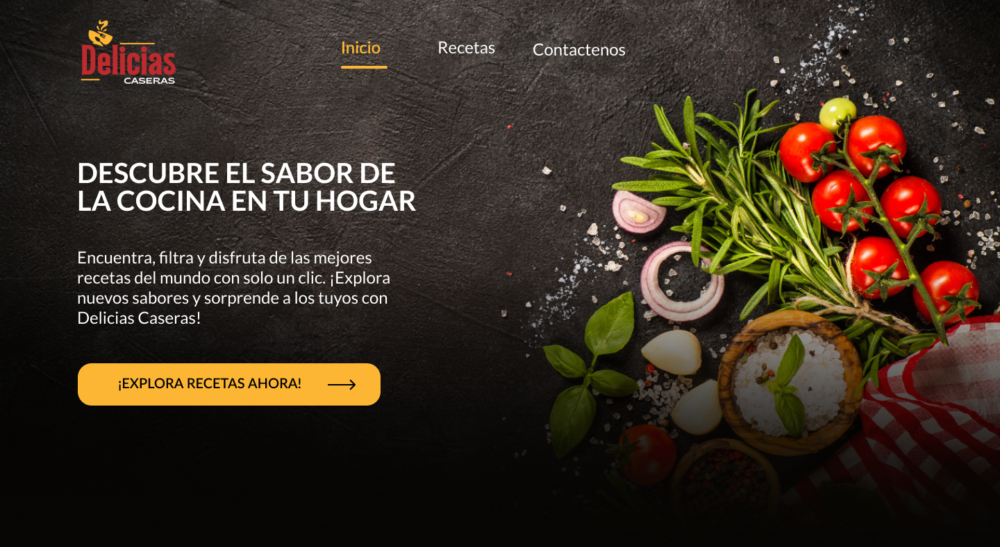

# Delicias Caseras 🍽️

**Delicias Caseras** es una aplicación web interactiva para buscar, filtrar y explorar recetas utilizando la [API de TheMealDB](https://www.themealdb.com/api.php). La aplicación te permite encontrar recetas aleatorias, ver detalles completos de cada receta, y gestionar tu propia lista de favoritos. Está construida con **React**, **Material UI**, y **Tailwind CSS** para proporcionar una interfaz rápida, responsiva y fácil de usar.

## Demo

## Características

- 🔍 **Buscar Recetas**: Busca recetas por nombre o filtra por categoría y área de origen.
- 🍴 **Ver Detalles**: Muestra información completa sobre la receta seleccionada, incluyendo ingredientes, instrucciones y videos de preparación.
- 🎲 **Recetas Aleatorias**: Explora recetas aleatorias en la página principal.
- 📑 **Modal de Receta Completa**: Visualiza las recetas en un modal de forma elegante y fácil de entender.
- ❤️ **Agregar a Favoritos**: Guarda tus recetas favoritas para revisarlas más tarde.

## Tecnologías Utilizadas

- **React**: Biblioteca de JavaScript para construir interfaces de usuario.
- **Material UI**: Librería de componentes de React que implementa los principios de diseño de Google.
- **Tailwind CSS**: Framework CSS para crear interfaces estilizadas rápidamente.
- **API de TheMealDB**: Fuente de datos para las recetas.
